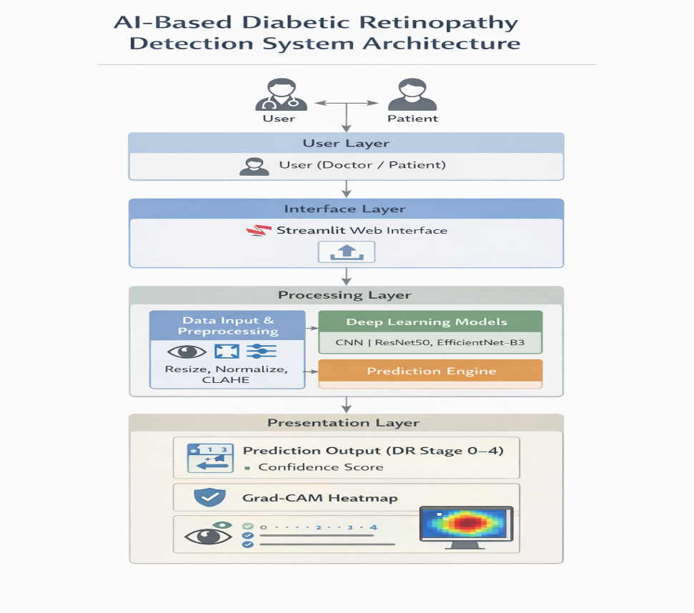
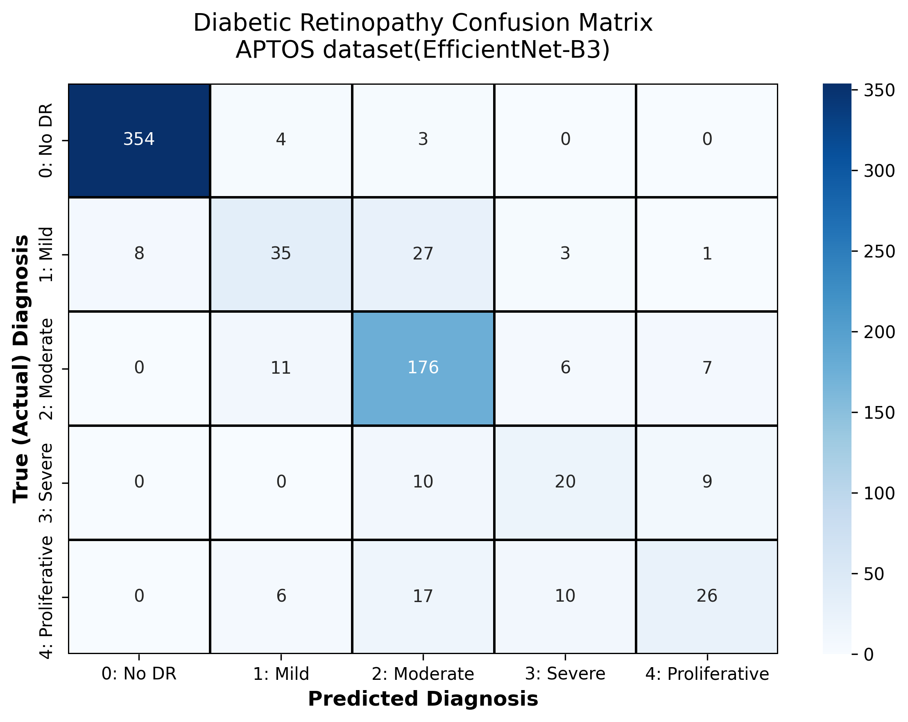
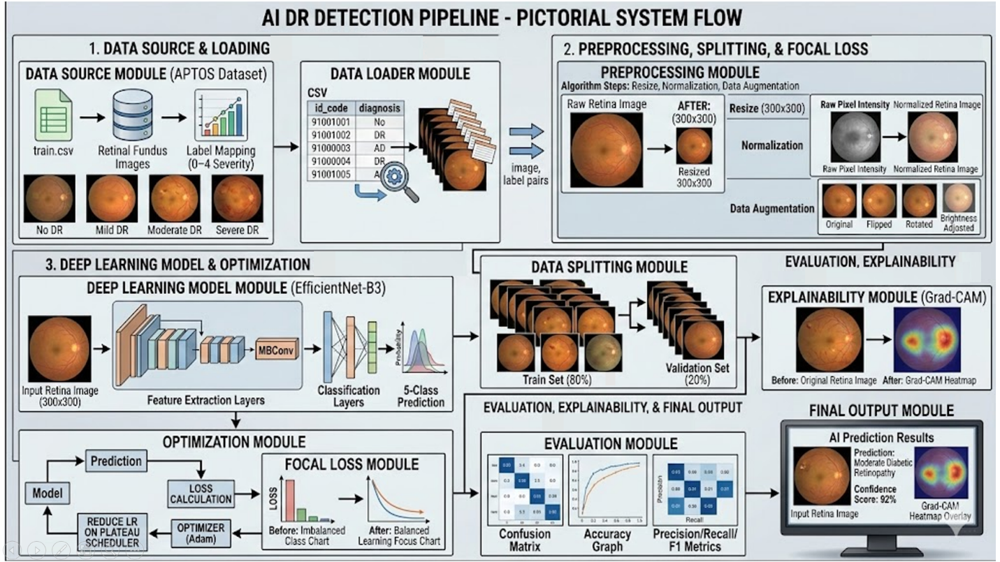
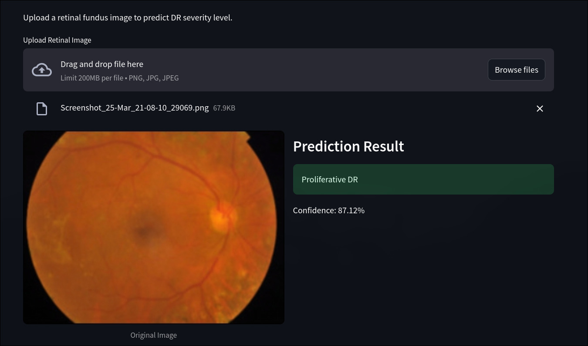
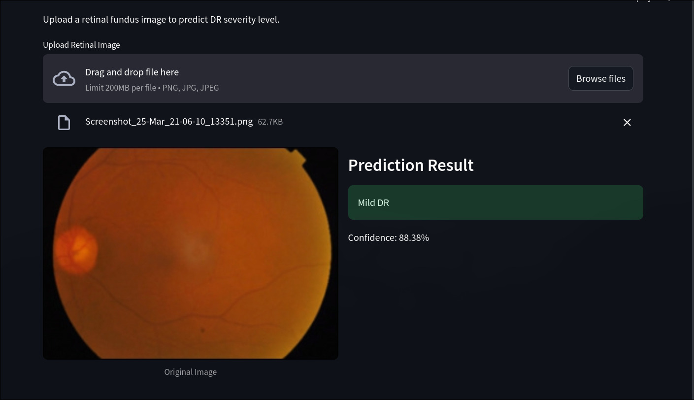
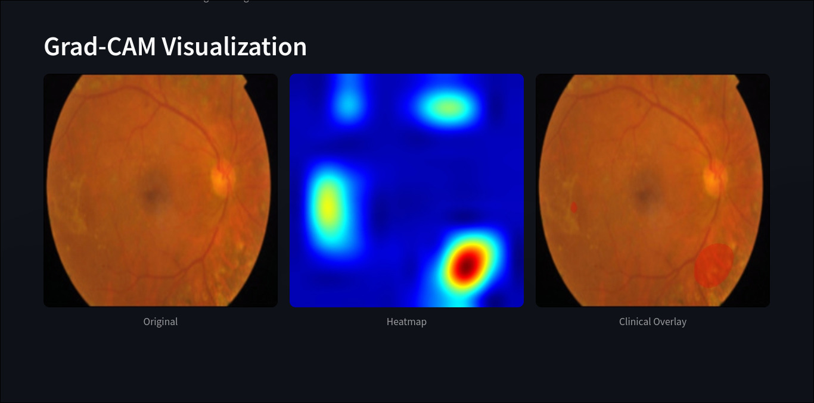

# Diabetic Retinopathy Detection System

A deep learning-based system for automated detection and classification of Diabetic Retinopathy (DR) from retinal fundus images. The system uses EfficientNet-B3 with explainable Grad-CAM visualizations.



## Table of Contents

- [Overview](#overview)
- [Dataset](#dataset)
- [Model Architecture](#model-architecture)
- [Training Details](#training-details)
- [Web Application](#web-application)
- [Example Results](#example-results)
- [Grad-CAM Visualization](#grad-cam-visualization)
- [Installation](#installation)
- [Usage](#usage)
- [Results](#results)
- [Project Structure](#project-structure)

## Overview

Diabetic Retinopathy is a diabetes complication that affects eyes. It's caused by damage to the blood vessels of the light-sensitive tissue at the back of the eye (retina). This project provides an automated solution to classify retinal fundus images into five severity levels:

| Class | Description |
|-------|-------------|
| 0 | No Diabetic Retinopathy |
| 1 | Mild DR |
| 2 | Moderate DR |
| 3 | Severe DR |
| 4 | Proliferative DR |

## Dataset

The model is trained on the **APTOS 2019 Blindness Detection** dataset, containing retinal images from rural India. The dataset is highly imbalanced, with the majority of images belonging to "No DR" or "Moderate DR" categories.



## Model Architecture

The system uses **EfficientNet-B3** as the backbone with a custom classification head:

```
EfficientNet-B3 (Backbone)
    └── Features (frozen)
    └── Classifier:
        ├── Linear(in_features=1536, out_features=512)
        ├── ReLU()
        ├── Dropout(0.4)
        └── Linear(in_features=512, out_features=5)
```

Key design decisions:
- **EfficientNet-B3**: Excellent accuracy-efficiency trade-off
- **Focal Loss**: Addresses class imbalance by focusing on hard-to-classify samples
- **Test-Time Augmentation (TTA)**: Improves prediction robustness by averaging predictions from original and horizontally flipped images

## Training Details

| Parameter | Value |
|-----------|-------|
| Backbone | EfficientNet-B3 (ImageNet pretrained) |
| Image Size | 300x300 |
| Batch Size | 16 |
| Optimizer | Adam (lr=2e-4) |
| Loss Function | Focal Loss (γ=2) |
| Scheduler | ReduceLROnPlateau |
| Epochs | 25 |
| Validation Split | 20% |

### Data Augmentation (Training)
- Random Horizontal Flip
- Random Rotation (±15°)
- Color Jitter (brightness, contrast, saturation)

## Web Application

The project includes a Streamlit web application for easy inference and visualization.



### Features
- **Image Upload**: Supports PNG, JPG, JPEG formats
- **Preprocessing Visualization**: Toggle to view CLAHE and Ben Graham processed images
- **Prediction**: Real-time DR severity classification with confidence score
- **Grad-CAM Visualization**: Explainable AI showing which regions the model focuses on

### Preprocessing Techniques
1. **CLAHE (Contrast Limited Adaptive Histogram Equalization)**: Enhances local contrast
2. **Ben Graham Processing**: A specialized preprocessing method for retinal images

## Example Results

Here are some example predictions from the web application:

### Proliferative DR Detection (Class 4)



### Moderate DR Detection (Class 2)



## Grad-CAM Visualization

The system uses Grad-CAM (Gradient-weighted Class Activation Mapping) to provide interpretable predictions. This technique highlights the regions in the fundus image that the model focuses on when making its prediction, which is crucial for medical AI explainability.



The visualization shows:
- **Original Image**: The input retinal fundus image
- **Heatmap**: Color-coded activation map showing importance weights
- **Clinical Overlay**: The heatmap overlaid on the original image for clinical interpretation

## Installation

```bash
# Clone the repository
git clone <repository-url>
cd DiabeticRetinopathy

# Install dependencies
pip install -r requirements.txt

# Download the pretrained model (if not included)
# Place Aptos_EB3.pth in the project root directory
```

### Requirements
- Python 3.8+
- PyTorch 2.0+
- Streamlit
- OpenCV
- NumPy
- Pillow

## Usage

### Running the Web Application

```bash
streamlit run app.py
```

The application will open in your browser at `http://localhost:8501`.

### Using the Application

1. **Upload Image**: Click "Upload Retinal Image" to select a fundus image
2. **Toggle Preprocessing**: Use sidebar checkboxes to view preprocessing effects
3. **View Prediction**: See the DR severity classification and confidence
4. **Analyze with Grad-CAM**: Review the heatmap showing model attention regions

## Results

The model achieved the following performance on the validation set:

| Metric | Value |
|--------|-------|
| Validation Accuracy | ~85.27% |
| Validation F1 Score | ~84.80% |
| Best Model Saved | Epoch 20 |

### Performance Progression

The model showed consistent improvement during training:
- Epoch 1: 72.14% train, 76.40% val accuracy
- Epoch 10: 93.51% train, 84.17% val accuracy  
- Epoch 20: 95.05% train, 85.27% val accuracy (best F1)

## Project Structure

```
DiabeticRetinopathy/
├── app.py                 # Streamlit web application
├── dretinopathy.ipynb     # Jupyter notebook for model training
├── Aptos_EB3.pth         # Trained model weights
├── images/
│   ├── Architecture.png  # System architecture diagram
│   ├── DataFlow.png     # Data flow diagram
│   ├── APTOS_EB3.png    # APTOS dataset samples
│   ├── GradCAM.jpeg     # Grad-CAM visualization example
│   ├── Proliferative_DR.jpeg  # Proliferative DR prediction example
│   └── Mid_DR.jpeg      # Moderate DR prediction example
└── README.md            # This file
```

